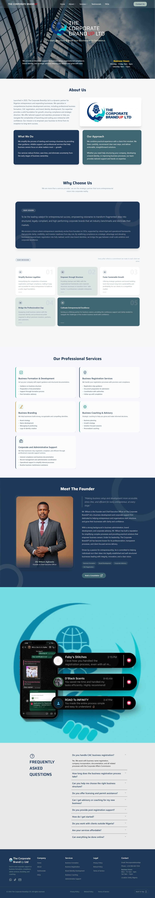

**THE CORPORATE BRANDUP LTD – LANDING PAGE**

A modern and responsive landing page built for The Corporate BrandUp Limited, designed to showcase the brand’s services with a clean UI, smooth animations, and great user experience.

🔗 Live site: https://www.thecorporatebrandupltd.com/

**SCREENSHOT**

📌 **PROJECT OVERVIEW**

This is a business landing page built to present a professional brand identity online. It focuses on simplicity, responsiveness, and performance while delivering a visually appealing user interface.

🚀 **FEATURES**

Fully responsive design (mobile, tablet, and desktop friendly)

Clean and modern UI

Smooth animations using Framer Motion

Optimized layout for performance and usability

Reusable and well-structured components

🛠️ **TECH STACK**

React.js – Frontend library

Tailwind CSS – Styling and layout

Framer Motion – Animations and transitions

Vite

🧠 **WHAT I LEARNED**

Building responsive layouts using Tailwind CSS

Creating smooth UI animations with Framer Motion

Structuring React components for readability and reuse

Improving UI/UX through spacing, typography, and layout

⚙️ **INSTALLATION & SETUP**

To run this project locally:

# Clone the repository

git clone https://github.com/Gt1code/brandup.git

# Navigate into the project folder

cd your-repo

# Install dependencies

npm install

# Start the development server

npm run dev

📸 **PREVIEW**

You can view the live version here:
👉 https://www.thecorporatebrandupltd.com/

👤 **AUTHOR**

Godstime Sunday
Frontend Web Developer

GitHub: https://github.com/Gt1code

Portfolio: https://sgodstime.vercel.app/

📄 **LICENSE**

This project is open-source and available under the MIT License.
